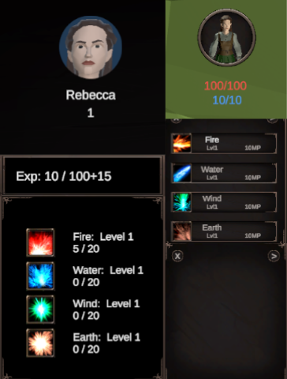
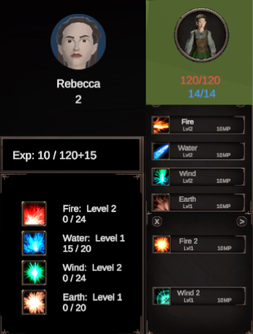
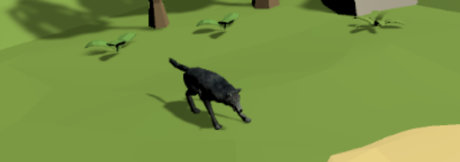
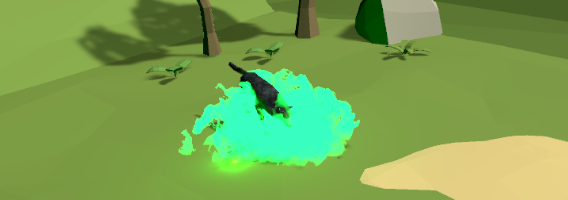
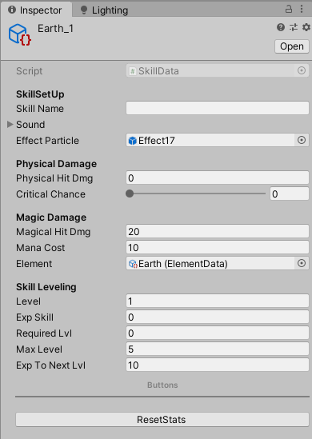
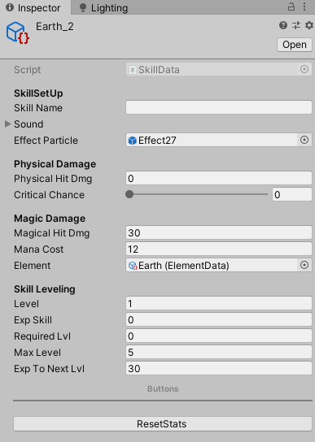
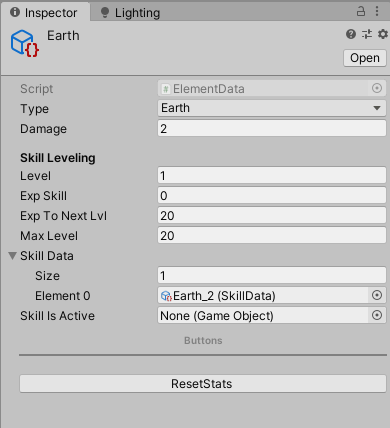
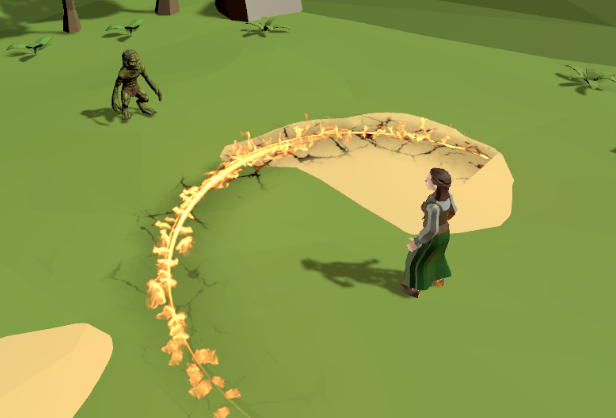
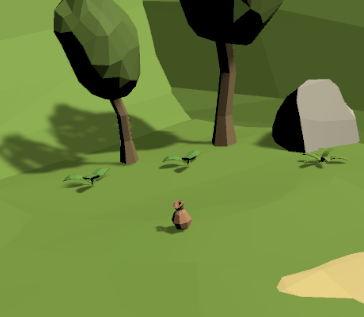
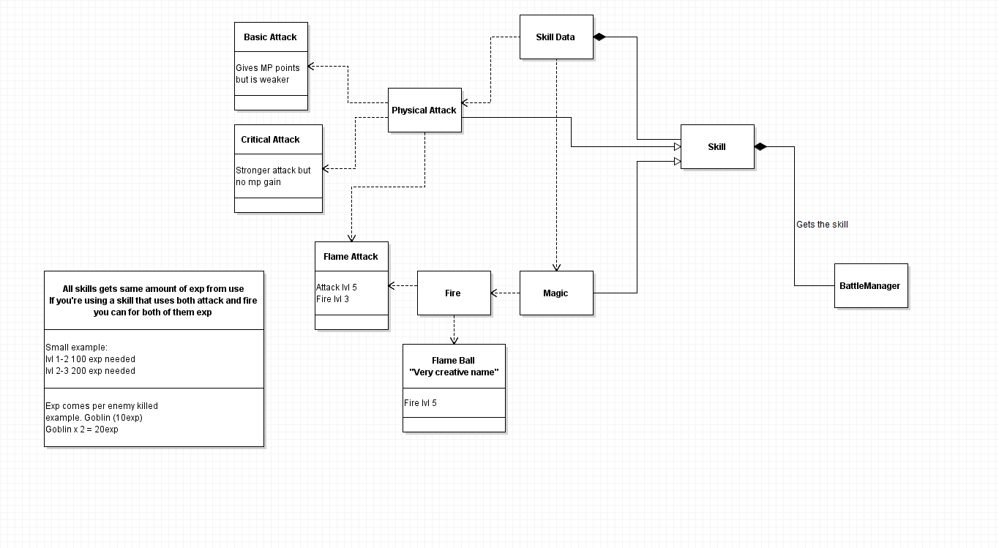

# CharredMeadows_Skills_Combat
A project I worked together with someone else. My job was to create the character/skill progression and combat. 
This was the first time I was creating a turn-based battle system and a character progression system..  

Below things will be better explained. 

GameManager:  
Gets/Sets Player Ref  
Stores player position to PlayerPrefs to save player position while jumping between main world and combat scene.  
Gets/Sets Enemy Ref 

LevelManager: 
World ref (Show/hide worldRoot while entering Combat)  
Loads levels 

PlayerData[Inherit from CreatureData]: 
Contains layer informatio, like health, level etc 
It also contains player leveling up progression and adds more after every level gained 

 
 
Skills: 
Tells how skills work in Battle. 

 
SkillData[ScriptableObject]: 
Skill information (Invidual skills which uses part from ElementalData) 
Levels Skill up (The higher level skill the more it hits) 
 

 
ElementalData[ScriptableObject]: 
Elemental information (Fire, Water, Wind & Earth) 
Levels Elements up (Leveling Elements adds new skills to player) 

  
EnemyManager: 
Puts enemy skills in use and tells how it works on the screen. 
Randomnizes on what skill enemy uses.  

 
BattleManager: 
Controls combat progression (Turns) 
Sets positions 
Puts drops on ground

 
UIManager: 
Shows information 

How the planning stage looked for the skill system.  

